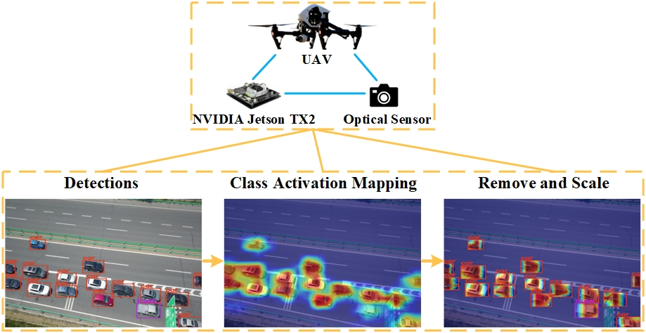
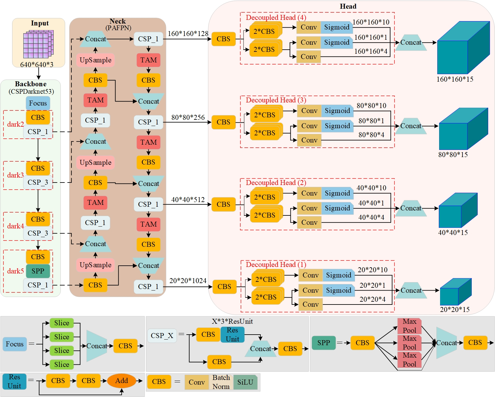
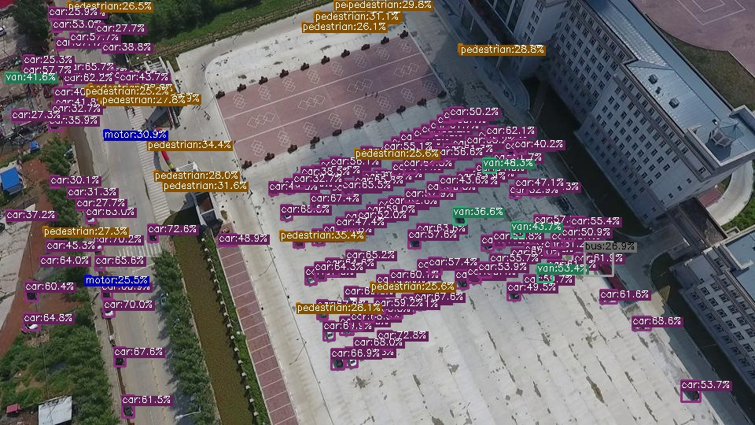
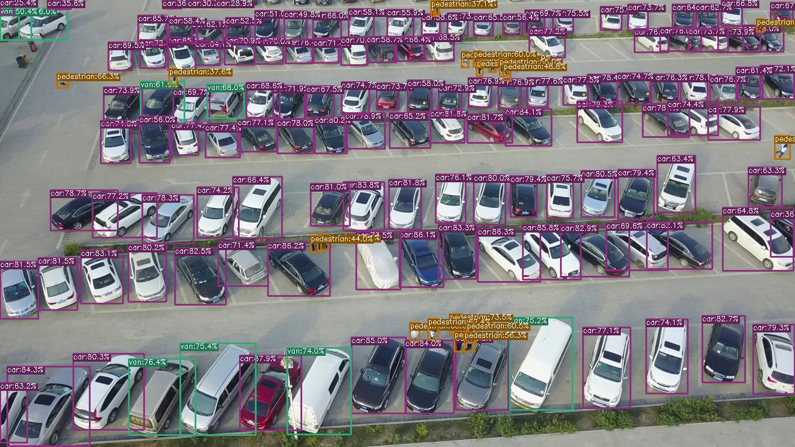
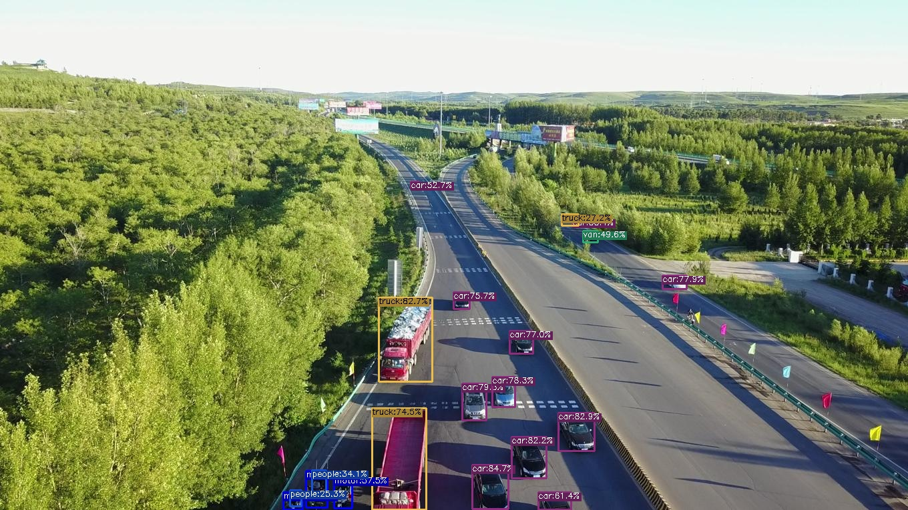
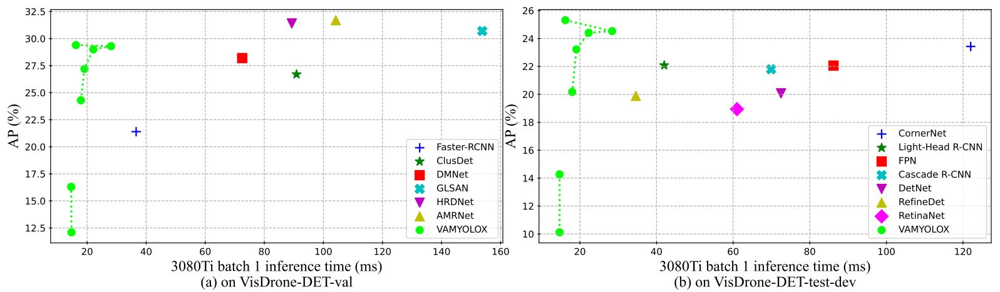

<<<<<<< HEAD
# VAMYOLOX
Our paper has been submitted to IEEE Sensors Journal for review. This code will be released once the paper is accepted.
=======
<div align="center"></div>


## Image detection results
- Small object detection

- Dense object detection

- Image covering a large area


## Video detection results
You can watch the video detection effect of VAMYOLOX through [bilibili](https://www.bilibili.com/video/bv1d14y157gk) or [YouTube](https://youtu.be/uOuAD4hC1ig).

## Speed-accuracy trade-offs


## Introduction
Based on [YOLOX](https://arxiv.org/abs/2107.08430), we propose an anchor-free detector specifically for UAV optical object detection, called VAMYOLOX. While balancing accuracy, speed and ease of deployment, VAMYOLOX can well solve the problems of dramatic scale changes, high density and large coverage of objects in UAV object detection scenarios.

Like YOLOX, this implementation of VAMYOLOX is also based on PyTorch..


## Benchmark
Note: All the pre-trained VAMYOLOX weight links lead to a Baidu Netdisk address with the extraction code: gpx1.
#### Standard Models.

|Model |size |AP<sup>0.5:0.95 <br/>(%)   |AP<sup>0.5 <br/>(%)| Speed 3080Ti<br>(ms) | Params<br>(M) |FLOPs<br>(G)| weights |
| ------        |:---: | :---:    | :---:       |:---:     |:---:  | :---: | :----: |
|VAMYOLOX-s|640|20.17 |34.20 |17.97      |9.69 | 60.35 | [Baidu Netdisk](https://pan.baidu.com/s/1xx120ONOk4TgW7k2hZJqUg) |
|VAMYOLOX-m|640|23.22 |38.19|19.13|27.07 |151.41| [Baidu Netdisk](https://pan.baidu.com/s/1xx120ONOk4TgW7k2hZJqUg) |
|VAMYOLOX-l|640|24.41|39.80|22.28|57.53|297.75| [Baidu Netdisk](https://pan.baidu.com/s/1xx120ONOk4TgW7k2hZJqUg) |
|VAMYOLOX-x|640|24.53|40.25|28.39|104.60|510.37| [Baidu Netdisk](https://pan.baidu.com/s/1xx120ONOk4TgW7k2hZJqUg) |
|VAMYOLOX-Darknet53|640|25.31|41.21|16.21|66.24|316.36| [Baidu Netdisk](https://pan.baidu.com/s/1xx120ONOk4TgW7k2hZJqUg) |


#### Light Models.

|Model |size |AP<sup>0.5:0.95 <br/>(%)|AP<sup>0.5 <br/>(%)|Speed 3080Ti<br>(ms)| Params<br>(M) |FLOPs<br>(G)| weights |
| ------        |:---:  |  :---:       |:---: |:---: |:---:   |:---:  | :---: |
|VAMYOLOX-Nano|416|10.12|17.80|14.76| 0.94|1.75 | [Baidu Netdisk](https://pan.baidu.com/s/1xx120ONOk4TgW7k2hZJqUg) |
|VAMYOLOX-Tiny|416|14.27|24.60|14.69|5.46|14.45| [Baidu Netdisk](https://pan.baidu.com/s/1xx120ONOk4TgW7k2hZJqUg) |


## Quick Start

<details>
<summary>Installation</summary>

Step1. Install VAMYOLOX from source.
```shell
git clone https://github.com/yangyahu-1994/VAMYOLOX.git
cd VAMYOLOX
pip3 install -U pip && pip3 install -r requirements.txt
pip3 install -v -e .  # or  python3 setup.py develop
```


<details>
<summary>Demo</summary>

Step1. Download a pretrained model from the benchmark table.

Step2. Use either -n or -f to specify your detector's config. For example:

```shell
python tools/demo.py image -n yolox-s -c /path/to/your/vamyolox_s.pth --path assets/dog.jpg --conf 0.25 --nms 0.45 --tsize 640 --save_result --device [cpu/gpu]
```
or
```shell
python tools/demo.py image -f exps/default/yolox_s.py -c /path/to/your/vamyolox_s.pth --path assets/dog.jpg --conf 0.25 --nms 0.45 --tsize 640 --save_result --device [cpu/gpu]
```
Demo for video:
```shell
python tools/demo.py video -n yolox-s -c /path/to/your/vamyolox_s.pth --path /path/to/your/video --conf 0.25 --nms 0.45 --tsize 640 --save_result --device [cpu/gpu]
```


</details>

<details>
<summary>Reproduce our results on VisDrone2019</summary>

Step1. Prepare VisDrone2019 dataset
```shell
cd <YOLOX_HOME>
ln -s /path/to/your/VisDrone2019 ./datasets/VisDrone2019
```

Step2. Reproduce our results on VisDrone2019 by specifying -n:

```shell
python -m yolox.tools.train -n yolox-s -d 8 -b 64 --fp16 -o [--cache]
                               yolox-m
                               yolox-l
                               yolox-x
```
* -d: number of gpu devices
* -b: total batch size, the recommended number for -b is num-gpu * 8
* --fp16: mixed precision training
* --cache: caching imgs into RAM to accelarate training, which need large system RAM. 

  

When using -f, the above commands are equivalent to:
```shell
python -m yolox.tools.train -f exps/default/yolox_s.py -d 8 -b 64 --fp16 -o [--cache]
                               exps/default/yolox_m.py
                               exps/default/yolox_l.py
                               exps/default/yolox_x.py
```


</details>


<details>
<summary>Evaluation</summary>

We support batch testing for fast evaluation:

```shell
python -m yolox.tools.eval -n  yolox-s -c vamyolox_s.pth -b 64 -d 8 --conf 0.001 [--fp16] [--fuse]
                               yolox-m
                               yolox-l
                               yolox-x
```
* --fuse: fuse conv and bn
* -d: number of GPUs used for evaluation. DEFAULT: All GPUs available will be used.
* -b: total batch size across on all GPUs

To reproduce speed test, we use the following command:
```shell
python -m yolox.tools.eval -n  yolox-s -c vamyolox_s.pth -b 1 -d 1 --conf 0.001 --fp16 --fuse
                               yolox-m
                               yolox-l
                               yolox-x
```

</details>


<details>
<summary>Tutorials</summary>

*  [Training on custom data](docs/train_custom_data.md)

</details>


## References
Thanks to their great works:

- [Megvii-BaseDetection/YOLOX](https://github.com/Megvii-BaseDetection/YOLOX)

>>>>>>> initial commit
